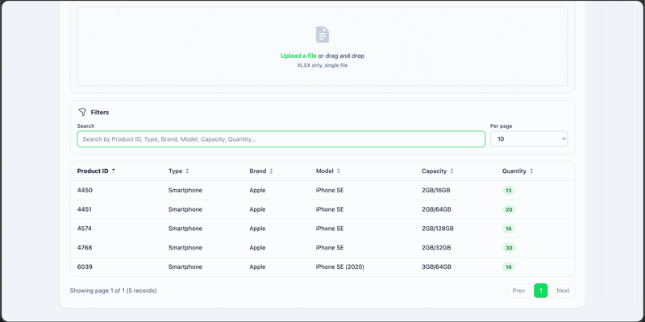
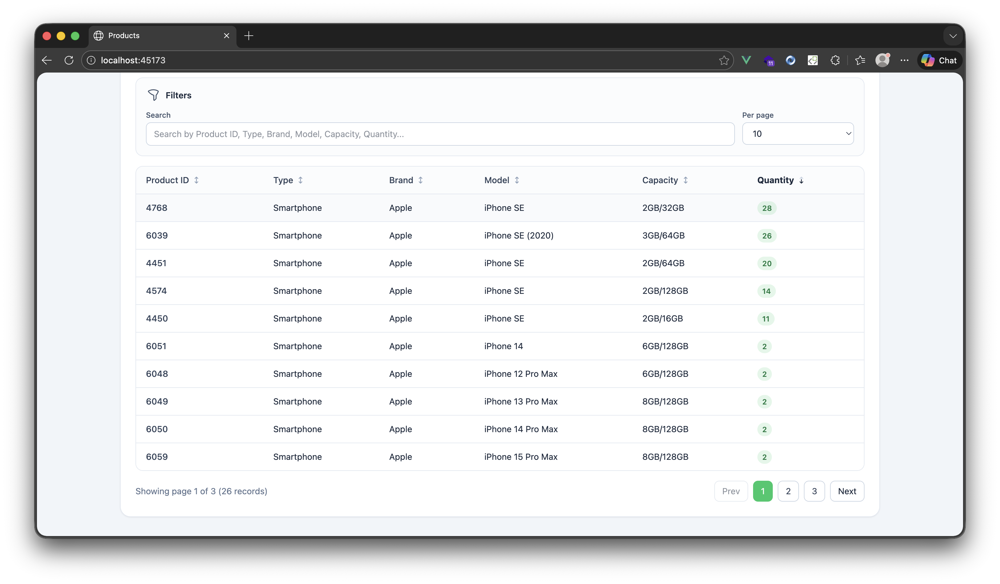

# Products



<br>
- Backend: Laravel 12 API (in [backend](backend))
- Frontend: Vue 3, Pinia, Tailwind and Vite (in [frontend](frontend))
- Stack: MySQL, Redis, Horizon and Reverb via Docker Compose

## Quick Start (Docker - Recommended)

From project root:

```bash
make setup
```

Open:

- Web: http://localhost:45173
- API: http://localhost:48000
- WebSocket: ws://localhost:48080

Stop stack:

```bash
make docker down
```

Rebuild from scratch:

```bash
make reset
```

## Make Commands

```bash
make setup
make reset
make help
make docker up
make docker build
make docker down
make docker rebuild
```

## Local Development (Without Docker)

### 1) Backend

From [backend](backend):

```bash
composer install
cp .env.example .env
php artisan key:generate
php artisan migrate
php artisan serve
```

Backend `.env` setup:

```env
DB_CONNECTION=mysql
DB_HOST=127.0.0.1
DB_PORT=3306
DB_DATABASE=yourdb
DB_USERNAME=root
DB_PASSWORD=

QUEUE_CONNECTION=redis
CACHE_STORE=redis
REDIS_CLIENT=phpredis
REDIS_HOST=127.0.0.1
REDIS_PORT=6379

FRONTEND_URL=http://localhost:5173

BROADCAST_CONNECTION=reverb

REVERB_APP_ID=281634
REVERB_APP_KEY=lcr9zyhymu88ryfhrrmz
REVERB_APP_SECRET=kge50tnhkr6lfvgni3wc

REVERB_SERVER_HOST=0.0.0.0
REVERB_SERVER_PORT=8080

REVERB_HOST=127.0.0.1
REVERB_PORT=8080
REVERB_SCHEME=http
```

Run queue worker / Horizon and Reverb (open separate terminals):

```bash
php artisan horizon
php artisan reverb:start
```

### 2) Frontend

From [frontend](frontend):

```bash
npm install
cp .env.example .env
npm run dev
```

Frontend `.env` setup:

```env
VITE_API_BASE_URL=http://localhost:8000/api
VITE_REVERB_APP_KEY=lcr9zyhymu88ryfhrrmz
VITE_REVERB_HOST=127.0.0.1
VITE_REVERB_PORT=8080
VITE_REVERB_SCHEME=http
```

Local Reverb check:

- Start backend (`php artisan serve`), horizon (`php artisan horizon`), and Reverb (`php artisan reverb:start`)
- Start frontend (`npm run dev`)
- Upload an `.xlsx` file and verify progress/status updates appear without manual refresh

## Testing

Backend tests (from [backend](backend)):

```bash
php artisan test
```

Frontend tests (from [frontend](frontend)):

```bash
npm test -- --run
```

## Build Frontend

From [frontend](frontend):

```bash
npm run build
```
